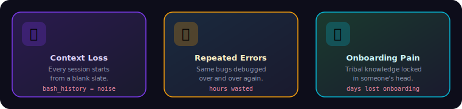
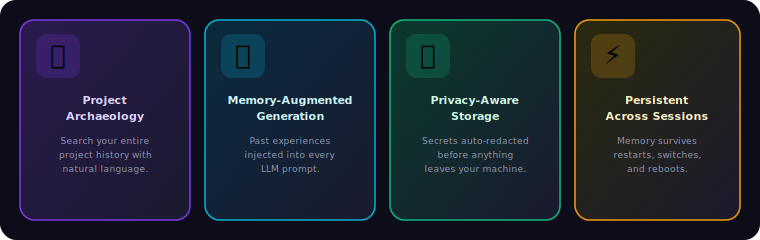
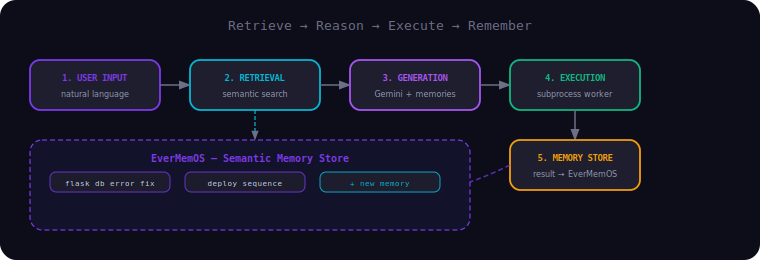
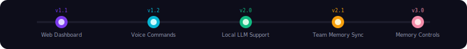

<div align="center">


# EverMind Terminal

**An AI-powered terminal with long-term semantic project memory**

[](https://python.org)
[](LICENSE)
[](https://github.com/EverMind-AI/EverMemOS)

</div>

---

## Table of Contents

- [The Problem](#the-problem)
- [Our Solution](#our-solution)
- [Key Features](#key-features)
- [Technology Stack](#technology-stack)
- [Project Structure](#project-structure)
- [Getting Started](#getting-started)
- [How It Works](#how-it-works)
- [Memory Commands](#memory-commands)
- [Privacy and Security](#privacy-and-security)
- [Testing](#testing)
- [Roadmap](#roadmap)
- [License](#license)

---

## The Problem

<div align="center">



</div>

Every terminal session starts with a blank slate. Developers constantly lose operational context:

- "How did we fix that database migration conflict last month?" Hours are lost re-debugging the same issue.
- "What was the exact command sequence for deploying the staging server?" Shell history is an unstructured, unsearchable mess.
- "How do I run this project?" New team members struggle with undocumented onboarding steps and tribal knowledge locked in someone's head.

Traditional terminals are amnesic. They execute commands but never learn from them. There is no mechanism to remember, reason over, or share the operational knowledge accumulated during development.

---

## Our Solution

EverMind Terminal is a memory-augmented terminal agent. It acts as a persistent operational brain for your projects, combining a large language model (Google Gemini) with a structured long-term memory backend (EverMemOS).

It does not just execute commands. After every interaction, it stores the prompt, the generated plan, and the result as a semantic memory. Before every new interaction, it retrieves the most relevant past experiences and injects them into the LLM context. Over time, the terminal becomes progressively smarter about your specific project.

---

## Key Features

<div align="center">



</div>

### Project Archaeology

EverMind Terminal indexes every command you run, every error you encounter, and every solution you apply. It uses semantic search via EverMemOS to let you ask natural language questions about your project history.

```
terminai> recall "database migration error"

On 2026-02-20, you ran `flask db upgrade` and encountered an alembic version conflict.
You resolved it by downgrading to version abc123 with `flask db downgrade abc123`,
then running `flask db upgrade` again.
```

### Memory-Augmented Command Generation

Before the LLM generates a plan for any new command, EverMind Terminal queries EverMemOS for the top semantically relevant past memories. These are injected directly into the Gemini prompt as context. The agent reasons with the accumulated knowledge of your project history rather than starting from scratch.

### Proactive Suggestions

The agent learns your workflow patterns and can suggest the next logical step based on what you and your team have done in similar situations before.

### Privacy-Aware Memory Storage

Sensitive data such as API keys, passwords, tokens, and long base64 strings is automatically redacted by the `privacy_filter` module before any content is sent to EverMemOS.

### Persistent Across Sessions

Memory survives terminal restarts, project switches, and machine reboots. Because EverMemOS stores memories in a persistent backend, your project operational knowledge accumulates indefinitely.

---

## Technology Stack

| Component | Technology |
|---|---|
| Core Language | Python 3.10+ |
| LLM Integration | Google Gemini Pro via `google-generativeai` |
| Long-Term Memory | EverMemOS (local Docker instance or Cloud API) |
| Local Database | Supabase (command history and session state) |
| User Interface | PyQt5 terminal emulator |
| Package Management | uv |
| Testing | pytest |

---

## Project Structure

```
EverMindTerminal/
├── src/
│   ├── main.py                   # Application entry point, PyQt5 UI, Worker thread
│   └── backups/                  # Incremental development snapshots
├── memory/
│   ├── evermem_client.py         # EverMemOS API wrapper (store + semantic search)
│   └── privacy_filter.py         # Redacts secrets before storing to memory
├── Model_json/
│   └── model_json.py             # Gemini prompt builder with memory_context injection
├── generation_models/
│   └── model_1..7.py             # Command generators and executors
├── json_parsing/
│   ├── categoriser.py            # Classifies LLM output into operation types
│   └── parser.py                 # Parses structured JSON plans from LLM responses
├── sequencer/
│   └── sequencer.py              # Manages ordered execution of multi-step plans
├── concat_model/
│   └── concat.py                 # Aggregates and formats multi-model outputs
├── utils/
│   ├── sanitizer/sanitise.py     # Input sanitization before LLM processing
│   ├── setup/                    # Setup scripts, SQL schema, system commands
│   └── test/                     # Test files
├── assets/                       # SVG diagrams and visual assets
├── address.py                    # Address book and project context registry
├── pyproject.toml                # Project dependencies (uv-managed)
├── .env.template                 # Environment variable template
└── LICENSE                       # GNU GPL v3.0
```

---

## Getting Started

### Prerequisites

- Python 3.10 or higher
- [uv](https://github.com/astral-sh/uv) package manager (`pip install uv`)
- Docker (for running EverMemOS locally)
- A Google Gemini API key from [Google AI Studio](https://aistudio.google.com/app/apikey)
- A Supabase project from [supabase.com](https://supabase.com) (optional, for cloud history)

### Step 1 -- Start EverMemOS Locally

EverMind Terminal requires a running EverMemOS instance for memory storage and retrieval.

```bash
git clone https://github.com/EverMind-AI/EverMemOS.git
cd EverMemOS
docker compose up -d
uv sync
uv run python src/run.py
```

Verify it is running:

```bash
curl http://localhost:1995/health
```

### Step 2 -- Clone and Configure

```bash
git clone https://github.com/Tasfia-17/evermind-terminal.git
cd evermind-terminal
cp .env.template .env
```

Edit `.env` and fill in your credentials:

```env
API_KEY="YOUR_GOOGLE_GEMINI_API_KEY"
EVERMEM_BASE_URL="http://localhost:1995/api/v1"
EVERMEM_API_KEY="YOUR_EVERMEMOS_API_KEY"
SUPABASE_URL="YOUR_SUPABASE_URL"
SUPABASE_KEY="YOUR_SUPABASE_KEY"
PROJECT_ID="my-project"
TEAM_ID="my-team"
```

### Step 3 -- Install and Run

```bash
uv sync
uv run python src/main.py
```

---

## How It Works

<div align="center">



</div>

EverMind Terminal follows a continuous loop: **Retrieve, Reason, Execute, Remember**.

1. **User Input** -- You type a natural language command or question into the terminal UI.
2. **Memory Retrieval** -- The `evermem_client` queries EverMemOS using hybrid semantic search for the top 3 most relevant past memories.
3. **Context Injection** -- Retrieved memories are formatted and injected into the Gemini prompt as prior context alongside the current input and system state.
4. **Plan Generation** -- Gemini generates a structured JSON operation plan containing one or more shell commands, categorized by type.
5. **Parsing and Sequencing** -- The `json_parsing` and `sequencer` modules parse the plan and queue operations in the correct execution order.
6. **Execution** -- A secure Python `Worker` thread executes each command in a subprocess, capturing stdout and stderr.
7. **Memory Formation** -- The original prompt, the generated plan, the command output, and the success status are stored back into EverMemOS as a new episodic memory scoped to your `PROJECT_ID`.
8. **Display** -- The terminal UI renders the output in real time.

---

## Memory Commands

| Command | Description |
|---|---|
| `recall "cors error"` | Semantic search of past memories matching the query |
| `remember "this project uses pyenv + poetry"` | Manually store a project fact or note |
| Any other natural language prompt | Full agent loop: memories retrieved, plan generated, executed, result stored |

---

## Privacy and Security

The `memory/privacy_filter.py` module runs before any content is sent to EverMemOS. It automatically redacts:

- API keys and tokens (detected by common patterns and prefixes)
- Passwords appearing in command arguments
- Long base64-encoded strings
- Environment variable values that match secret patterns

Redacted content is replaced with a placeholder so the memory remains useful for context without exposing sensitive data. All redaction happens locally before any network call is made.

---

## Testing

```bash
pip install pytest
pytest utils/test/
```

Test coverage includes:

- **Command execution logic** -- Verifying the `Worker` class correctly parses and runs sequential command plans.
- **JSON parsing** -- Testing the categoriser and parser against valid and malformed LLM outputs.
- **Memory integration** -- Mocking the EverMemOS client to test storage and retrieval logic in isolation.
- **Terminal UI** -- Basic interaction tests for the PyQt5 terminal emulator.
- **Error handling** -- Ensuring failed commands are captured, displayed, and stored correctly.

---

## Roadmap

<div align="center">



</div>

- **Web Dashboard** -- A browser-based GUI to visualize project memory, browse error history, and manage team knowledge.
- **Voice Commands** -- Natural speech input for hands-free terminal control.
- **Local LLM Support** -- Option to use models such as Llama 3 or Mistral locally for full offline privacy.
- **Team Memory Sync** -- Shared EverMemOS namespace so all team members benefit from each other's discoveries and fixes.
- **Granular Memory Controls** -- Per-project and per-command rules for what gets stored, retained, or deleted.

---

## License

This project is licensed under the GNU General Public License v3.0. See the [LICENSE](LICENSE) file for full details.
